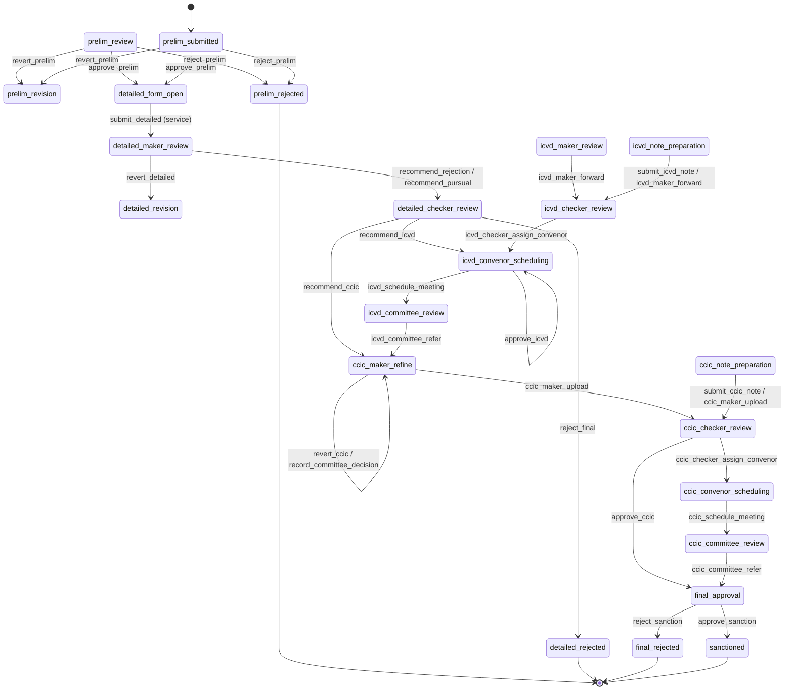
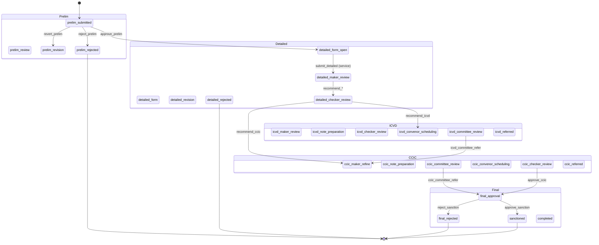

# Application Workflow — State Machine

Reflects `WorkflowEngine.java` (**WorkflowStep** = states, **WorkflowAction** = transitions) and `ApplicationService.java` (status/stage and `submitDetailed`).

- **Prelim:** SIDBI approves → **detailed_form_open**. Applicant has no workflow action; form is filled and submitted via `ApplicationService.submitDetailed()`, which sets step to **detailed_maker_review**.
- **Detailed maker/checker:** Maker can revert to **detailed_revision** or send to **detailed_checker_review**; checker can reject (**detailed_rejected**), recommend IC-VD (**icvd_convenor_scheduling**), or recommend CCIC (**ccic_maker_refine**).
- **Rejection** only at prelim (`reject_prelim`), detailed checker (`reject_final`), or sanction (`reject_sanction`).

---

## 1. Full state diagram (Mermaid)

---

## 2. Main path (happy path)

---

## 3. Phases (grouped)

---

## 4. Transition table (WorkflowEngine + ApplicationService)

| From step | Allowed action(s) | To step |
|-----------|-------------------|---------|
| prelim_review, prelim_submitted | revert_prelim | prelim_revision |
| prelim_review, prelim_submitted | reject_prelim | prelim_rejected |
| prelim_review, prelim_submitted | approve_prelim | detailed_form_open |
| detailed_form_open | _(none in engine)_ | — |
| — | submit_detailed (ApplicationService.submitDetailed) | detailed_maker_review |
| detailed_maker_review | revert_detailed | detailed_revision |
| detailed_maker_review | recommend_rejection, recommend_pursual | detailed_checker_review |
| detailed_checker_review | reject_final | detailed_rejected |
| detailed_checker_review | recommend_icvd | icvd_convenor_scheduling |
| detailed_checker_review | recommend_ccic | ccic_maker_refine |
| icvd_maker_review | icvd_maker_forward | icvd_checker_review |
| icvd_note_preparation | submit_icvd_note, icvd_maker_forward | icvd_checker_review |
| icvd_checker_review | icvd_checker_assign_convenor | icvd_convenor_scheduling |
| icvd_convenor_scheduling | icvd_schedule_meeting | icvd_committee_review |
| icvd_convenor_scheduling | approve_icvd | icvd_convenor_scheduling |
| icvd_committee_review | icvd_committee_refer | ccic_maker_refine |
| ccic_maker_refine | ccic_maker_upload | ccic_checker_review |
| ccic_maker_refine | revert_ccic, record_committee_decision | ccic_maker_refine |
| ccic_note_preparation | submit_ccic_note, ccic_maker_upload | ccic_checker_review |
| ccic_checker_review | ccic_checker_assign_convenor | ccic_convenor_scheduling |
| ccic_checker_review | approve_ccic | final_approval |
| ccic_convenor_scheduling | ccic_schedule_meeting | ccic_committee_review |
| ccic_committee_review | ccic_committee_refer | final_approval |
| final_approval | approve_sanction | sanctioned |
| final_approval | reject_sanction | final_rejected |

**Terminal (no outgoing actions in engine):** prelim_revision, prelim_rejected, detailed_form, detailed_form_open, detailed_revision, detailed_rejected, icvd_referred, ccic_referred, final_rejected, sanctioned, completed.
